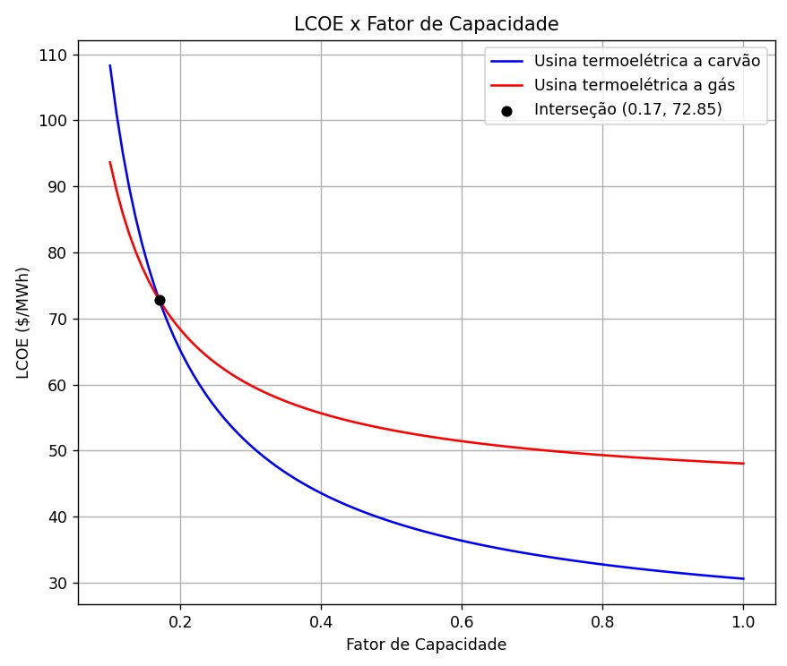
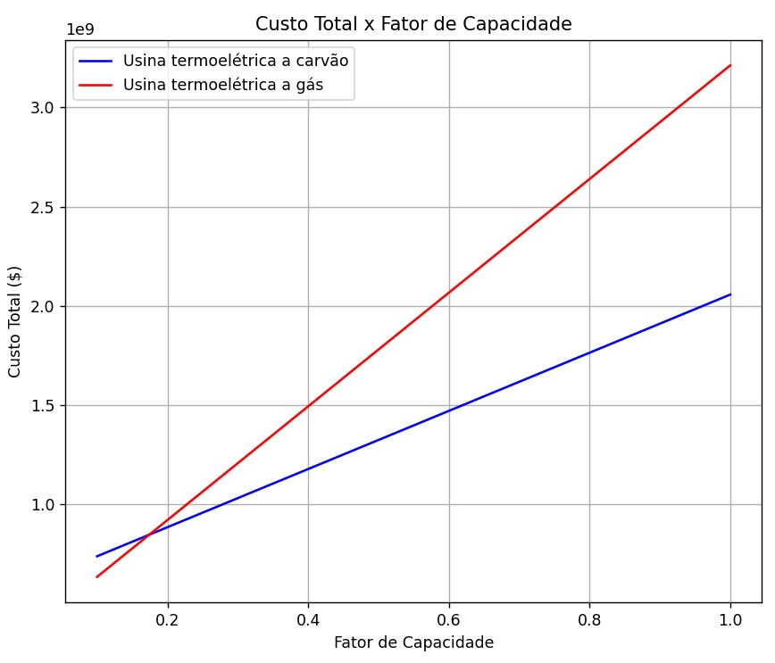

# Terceira Avaliação de Economia de Energia - Custo Nivelado de Energia Eletrica

**Disciplina**: FGA 0265 Economia de Energia, Turma 01/2024.1

**Docentes**: Augusto Cesar de Mendonça Brasil e Rudi Henri van Els

## Discentes
|Matrícula | Aluno | Curso |
| -- | -- | -- |
| 20/0061216  |  Cleber de Oliveira Brant | Eng. Software |
| 19/0042672  |  Gabriel Pereira Cortez | Eng. Energia |
| 20/0062450  |  Marina da Matta Nery | Eng. Energia |

## Sobre
Este trabalho tem o objetivo de apresentar o desenvolvimento de uma aplicação para calcular e comparar o Custo Nivelado de Energia Elétrica (LCOE - Levelized Cost of Electricity) de duas usinas termelétricas, uma a carvão e outra a gás.

**Linguagem**: Python 
**Bibliotecas necessárias**: matplotlib, numpy e pandas

## Configuração do Ambiente
Para rodar o programa, é necessário configurar seu ambiente fazendo uma instalação prévia do Python 3. Recomenda-se a utilização do Visual Studio Code, e duas extensões dentro do mesmo, o Jupyter e o Python, que também precisam de instalação prévia. Após isso, é necessário instalar as bibliotecas em algum terminal de seu computador.

## Resultados
### Lcoe x Fator Capacidade

### Custo Total x Fator Capacidade

